# DevMentor-360 🤖✨

> **Transform Code into Gold with AI-Powered Engineering**  
> Built for AWS Global Vibe: AI Coding Hackathon 2025

[](https://opensource.org/licenses/MIT)
[](https://www.typescriptlang.org/)
[](https://reactjs.org/)
[](https://aws.amazon.com/bedrock/)
[](https://www.anthropic.com/claude)

---

## 🎯 What is DevMentor-360?

DevMentor-360 is an **autonomous AI engineering platform** that acts as your personal development team. Powered by **AWS Bedrock** and **Claude 3.5 Sonnet**, it provides five specialized AI agents that analyze, debug, review, and test your code in real-time.

### 🏆 Hackathon Highlights
- ✅ **AWS Bedrock Integration** with Claude 3.5 Sonnet
- ✅ **Amazon Q Developer** used throughout development
- ✅ **Hybrid AI Architecture** (Deterministic + Generative)
- ✅ **Live Terminal** with real-time agent logs
- ✅ **Markdown-Formatted Reports** with syntax highlighting
- ✅ **"Alchemist" Theme** - Premium dark UI with gold accents

---

## 📸 Screenshots

### Landing Page


### Workspace Interface


### Agent Analysis Output


---

## 🌟 Features

### 🧠 AI Agents (Powered by AWS Bedrock)

#### 1. **The Architect** 🏗️
- **Hybrid Analysis**: Combines deterministic metrics (coupling, cohesion) with GenAI insights
- Detects circular dependencies and design anti-patterns
- Generates comprehensive architecture design documents
- **Model**: Claude 3.5 Sonnet via AWS Bedrock

#### 2. **The Debugger** 🐛
- Analyzes stack traces and code context using GenAI
- Explains root causes in plain English
- Auto-generates code patches with confidence scores
- **Model**: Claude 3.5 Sonnet via AWS Bedrock

#### 3. **The Reviewer** 🔍
- Deep security audits (SQL injection, XSS, etc.)
- Performance bottleneck detection
- Best practices validation
- **Model**: Claude 3.5 Sonnet via AWS Bedrock

#### 4. **The Tester** 🧪
- Generates comprehensive Jest test suites
- Covers happy paths, edge cases, and error handling
- Understands code logic to write meaningful tests
- **Model**: Claude 3.5 Sonnet via AWS Bedrock

#### 5. **The Productivity Agent** 📝
- Auto-generates documentation and READMEs
- Creates Mermaid diagrams (architecture, flow, class)
- Summarizes complex codebases

### 💻 Developer Experience

- **Monaco Code Editor** with syntax highlighting
- **Load Example** button with pre-loaded buggy code samples
- **Live Terminal** showing real-time agent activity
- **Markdown Rendering** for beautiful, formatted AI reports
- **Glassmorphism UI** with smooth animations
- **Dark Theme** optimized for long coding sessions

---

## 🏗️ Architecture

```mermaid
graph TD
    subgraph Frontend["🎨 Frontend (React + TypeScript)"]
        Landing[Landing Page]
        Workspace[Workspace]
        Monaco[Monaco Editor]
    end

    subgraph Backend["⚙️ Backend (Node.js + Express)"]
        API[API Routes]
        Orchestrator[Agent Orchestrator]
    end

    subgraph Agents["🤖 AI Agents"]
        LLM[LLM Service]
        Arch[Architect Agent]
        Debug[Debugger Agent]
        Review[Reviewer Agent]
        Test[Tester Agent]
    end

    subgraph AWS["☁️ AWS Services"]
        Bedrock[AWS Bedrock]
        Claude[Claude 3.5 Sonnet]
    end

    Landing --> Workspace
    Workspace --> Monaco
    Workspace --> API
    API --> Orchestrator
    Orchestrator --> Arch
    Orchestrator --> Debug
    Orchestrator --> Review
    Orchestrator --> Test
    
    Arch --> LLM
    Debug --> LLM
    Review --> LLM
    Test --> LLM
    
    LLM --> Bedrock
    Bedrock --> Claude
```



---

## 🚀 Quick Start

### Prerequisites
- **Node.js** 18+
- **npm** or **yarn**
- **AWS Account** with Bedrock access

### Installation

```bash
# Clone the repository
git clone https://github.com/urvashi-agrawal-dev/ai-agent-coding-platform.git
cd ai-agent-coding-platform

# Install dependencies
npm install

# Start development servers
npm run dev
```

The application will be available at:
- **Frontend**: http://localhost:3000
- **Backend**: http://localhost:5000

---

## ⚙️ AWS Bedrock Setup

### Step 1: Create an AWS Account
1. Go to [AWS Console](https://aws.amazon.com/)
2. Sign up or log in

### Step 2: Enable Claude 3.5 Sonnet in Bedrock
1. Navigate to **AWS Bedrock** in the console
2. Go to **Model Access** (left sidebar)
3. Click **Manage Model Access**
4. Find **Anthropic** → **Claude 3.5 Sonnet**
5. Check the box and click **Request Access**
6. Wait for approval (usually instant)

### Step 3: Create IAM User with Bedrock Permissions
1. Go to **IAM** → **Users** → **Create User**
2. Enter a username (e.g., `devmentor-bedrock`)
3. Attach the policy: **AmazonBedrockFullAccess**
4. Click **Create User**

### Step 4: Generate Access Keys
1. Click on the created user
2. Go to **Security Credentials** tab
3. Click **Create Access Key**
4. Choose **Application running outside AWS**
5. Copy the **Access Key ID** and **Secret Access Key**

### Step 5: Configure Backend Environment
Create `backend/.env`:
```env
PORT=5000
AWS_ACCESS_KEY_ID=your_access_key_here
AWS_SECRET_ACCESS_KEY=your_secret_key_here
AWS_REGION=us-east-1
```

### Step 6: Restart the Backend
```bash
cd backend
npm run dev
```

> **Note**: Without AWS credentials, the agents will return credential errors. You can still explore the UI and use the "Load Example" feature.

---

## 📁 Project Structure

```
DevMentor-360/
├── frontend/              # React + TypeScript + Vite
│   ├── src/
│   │   ├── components/   # UI components (LandingPage, Workspace, AgentPanel)
│   │   ├── App.tsx       # Main router
│   │   └── index.css     # Alchemist theme styles
│   └── tailwind.config.js
├── backend/              # Node.js + Express
│   ├── src/
│   │   ├── routes/       # API routes
│   │   ├── services/     # Business logic
│   │   └── index.ts      # Server entry point
│   └── .env              # AWS credentials
├── agents/               # AI Agent implementations
│   ├── src/
│   │   ├── architect-agent.ts
│   │   ├── debugger-agent.ts
│   │   ├── reviewer-agent.ts
│   │   ├── tester-agent.ts
│   │   └── services/
│   │       └── llm.service.ts  # AWS Bedrock integration
│   └── package.json
└── shared/               # Shared TypeScript types
    └── src/types.ts
```

---

## 🎨 Design Philosophy: "Digital Alchemy"

The UI is inspired by the concept of **transforming code into gold**:
- **Void Black** (`#050505`) - The canvas
- **Alchemist Gold** (`#FFD700`) - Primary actions and highlights
- **Psychology Colors**:
  - Purple (`#9D00FF`) - Architect Agent
  - Blue (`#00E0FF`) - Debugger Agent
  - Green (`#00FF94`) - Tester Agent
  - Red (`#FF0055`) - Errors

### Typography
- **Cinzel** - Headers (elegant, authoritative)
- **Outfit** - UI text (modern, readable)
- **Fira Code** - Code blocks (monospace with ligatures)

---

## 🛠️ Tech Stack

### Frontend
- **React** 18 with TypeScript
- **Vite** for blazing-fast builds
- **TailwindCSS** for styling
- **Framer Motion** for animations
- **Monaco Editor** for code editing
- **React Markdown** + **React Syntax Highlighter** for AI output

### Backend
- **Node.js** + **Express**
- **TypeScript** for type safety
- **WebSockets** for real-time communication
- **Multer** for file uploads

### AI/ML
- **AWS Bedrock** for model hosting
- **Claude 3.5 Sonnet** for GenAI capabilities
- **@aws-sdk/client-bedrock-runtime** for API integration

---

## 🎥 Demo Video

> **Coming Soon**: A 2-minute walkthrough showing the agents in action!

---

## 🤝 Built With Amazon Q Developer

This project was developed with the assistance of **Amazon Q Developer**, which helped with:
- Architecting the AWS Bedrock integration
- Generating boilerplate code for agents
- Debugging credential provider issues
- Optimizing TypeScript types

See [`DEVELOPMENT_JOURNEY.md`](./DEVELOPMENT_JOURNEY.md) for the full story.

---

## 👥 Team

### Karan Bansal
- **GitHub**: [@karanmax999](https://github.com/karanmax999)
- **Role**: Full-Stack Developer & AI Integration Specialist

### Urvashi Agrawal
- **GitHub**: [@urvashi-agrawal-dev](https://github.com/urvashi-agrawal-dev)
- **Role**: Project Lead & Architecture

---

## 📜 License

This project is licensed under the MIT License - see the [LICENSE](LICENSE) file for details.

---

## 🙏 Acknowledgments

- **AWS** for providing Bedrock and Claude 3.5 Sonnet access
- **Anthropic** for creating Claude, the brain behind our agents
- **Amazon Q Developer** for being an invaluable coding assistant
- **AWS Global Vibe Hackathon 2025** for the opportunity

---

## 🔗 Links

- **Live Demo**: [Coming Soon]
- **Video Walkthrough**: [Coming Soon]
- **GitHub Repository**: https://github.com/urvashi-agrawal-dev/ai-agent-coding-platform
- **AWS Bedrock**: https://aws.amazon.com/bedrock/
- **Claude 3.5 Sonnet**: https://www.anthropic.com/claude

---

<div align="center">

**Built with ❤️ for AWS Global Vibe: AI Coding Hackathon 2025**

⭐ Star this repo if you found it helpful!

</div>
